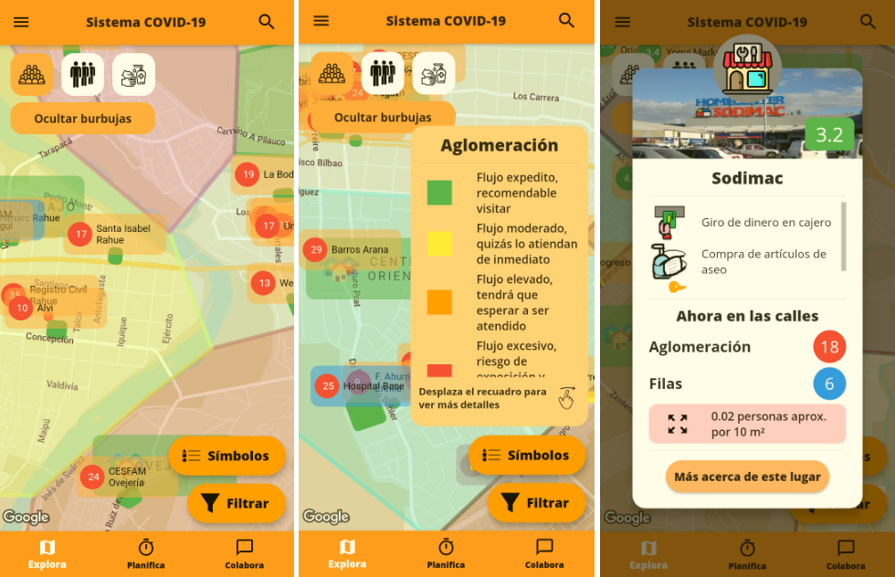
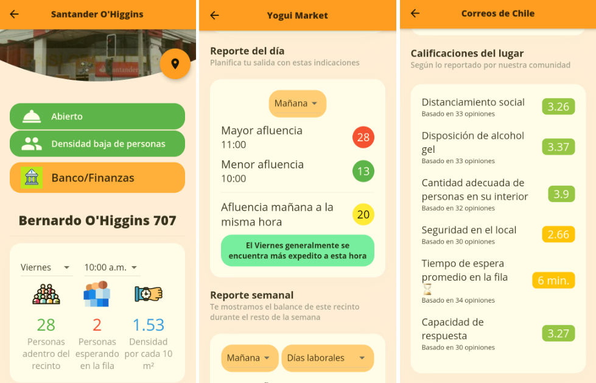
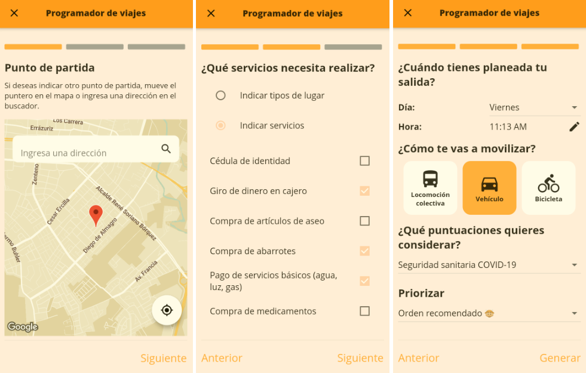
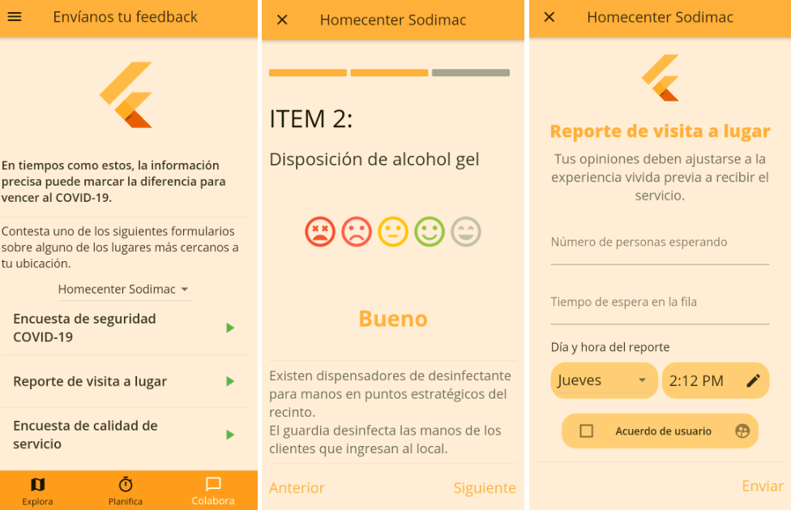
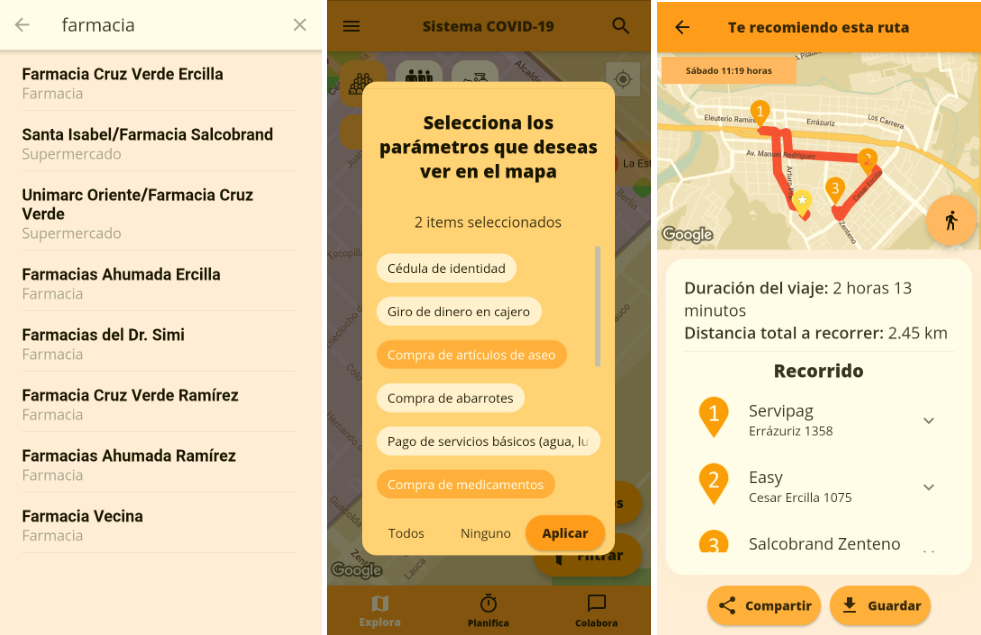

# VacApp - The Client App

Software project in current development and (potentially) awaiting a redesign depending in the current requirements of our end users. This was conceived as a solution to everyday problems during the COVID-19 pandemic, but since the lockdown is no more, I have to give a second thought to some of its key features. Hopefully this sees the light of day eventually.

In the meanwhile, you can check the various modules of this app. This is a refactor of the first version of this mobile app, made as a part of my thesis project to graduate as a computer engineer. I added a business logic layer because many components grew too large to be maintainable in future iterations. I also implemented various design patterns to certain areas of the codebase to improve maintainibility.

Regarding this repo, this is a duplicate of my private project with the travel scheduler and user feedback modules excluded. Details of these modules can be found in the descriptions below.

# Videos

# What is VacApp Mobile?

It's a mobile application for Android and iOS devices, developed with the Flutter framework, that offers real-time estimations of crowd density and safety levels at key locations throughout the city of Osorno. These locations range from supermarkets, pharmacies and hardware stores to banks, public services and hospitals. The users can see those indicators in an interactive map with additional information about those points of interest.

# Technologies used

- Flutter
- Google Maps SDK for Android and iOS
- Google Directions API
- GraphQL Client
- BLoC

# Features

## Map view

Displays a customized instance of Google © Maps with markers and polygons throughout the urban area of Osorno. Users can view registered places in the database within close proximity to their current location; if georeferencing services are not authorized, the default location will be the city's Plaza de Armas.

Each visible place on the map features an information bubble showing the name of the venue and a descriptive value regarding the place's activity; by default, it indicates the average number of people inside at the current hour. The geographic area of each place is defined by a polygon, each of which is colored and demarcated to be easily distinguishable. The color of these polygons is determined by the population density within them.

Additionally, the screen provides a map legend visualizer with relevant details about the markers and polygons in the map, as well as a filter utility enabling users to display places of a specific type or service.

## Place details

This screen provides a extended description of a specific place within the city. The current and overall status of the venue is summarized, enabling users to determine if it's suitable to visit at their current time. The summary is presented in the following categories:

- **Population density**: also referred to as foot traffic or relative population, indicates the average number of individuals moving through a specific surface area (in this case, the dimensions provided within the facilities for the movement of its customers).

- **Status of the venue**: indicates whether a place is open at the user's current time or if it is closed. It also considers cases where the service operates on an extended schedule.

Other more specific categories are the following:

- **Attendance stats**: here, users can check the concentration of people for a specific day and time. From a dropdown list of available operating hours for the venue, users can select the corresponding on-site activity.

- **Daily and weekly crowd report**: Provides a summary of useful data regarding the venue's capacity, either for inmediate visits or within the week.

- **Venue ratings**: Provides a breakdown of the place's scores given by the community. For each category displayed, the name of the category, the average up to the last feedback processed by the server, and the number of users who have given their opinion are shown.

## Travel scheduler

This is a service that recommends a travel itinerary from a specified starting point to a number of destinations so that users can accomplish all of their tasks. Details about the logic behind this procedure are outlined in the respective backend algorithm (see the backend repo).

Regarding the frontend, the purpose of this view is to gather the necessary user inputs for the eventual API query, which aims to execute the algorithm from the server. It's like a user form separated in three different screens, each gathering the user's requirements with a panel or section of input. These secondary panels are as follows:

- Starting point: Captures a geographic location on the map within the urban limits of the city. Initiated by default at the device's current location or at the Plaza de Armas depending on software permissions, the screen allows users to modify it by moving the marker to another point or by entering the street name in the search box at the top of the map.

- Search Parameters: Gathers the list of user requirements that the calculated route must meet, which can include types or services associated with the stopping points. Users can only select from one of the two filters. The design of this selector limits the number of selected elements to only three, with the aim of reducing, for user safety, the number of places to visit on the journey.

- Additional Details: Gathers the remaining attributes of the request, such as the day and time of departure, the mode of transportation to be used, the type of indicators to be accounted for, and the variable to prioritize in the search.

When pressing the "Generate" button, the app calls the backend API with the request's parameters. Depending on the response received (success or error), the user will be notified if any issues occured. If possible, the app will grant the user the possibility to check an alternative travel itinerary with some of the less prioritary requeriments discarded.

## User feedback

It manages user contributions to enhance the effectiveness of ratings given to places on the map, as well as supplementing activity records on streets for generating new results.

Feedback is received through questionnaires and reports about a specific location. Users can only rate locations near their current point or those in their recent visit history. Additionally, feedback submission for a place is limited to once a week, as checked in the user settings saved internally in the application.

The qualification tools are the following:

- Rating Survey: Allows users to input ratings for the place. The software features two distinct forms to fill out: one for indicators specific to COVID-19 emergency and another for service quality and customer attention. Ratings per category are captured using a rating scale from 1 (poor) to 5 (excellent). At the bottom of the screen, the statements that the user should consider when issuing their rating are displayed.

- Visited Place Report: Gathers feedback provided by the user about a specific place, regarding the wait time before receiving service.

## Travel itinerary visualization

Displays the travel report in a Google © Maps map sent by the backend API in response to the travel scheduler screen's request. This itinerary contains the best transit route considering safe and available venues located near the user.

The starting point and the places to visit are represented as markers in the map, and the initial camera zoom ensures complete visibility of all the highlights. The route is shown through a polyline passing through all the points of interest.

Additional information about the trip is displayed below the map, and the user can visit the detailed profile of each place by clicking on it.

Users can store the generated travel report, and even share it via messaging applications as WhatsApp. The generated file can be either a image summary of the itinerary or a JSON file that can be reloaded later on in the app.

